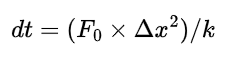
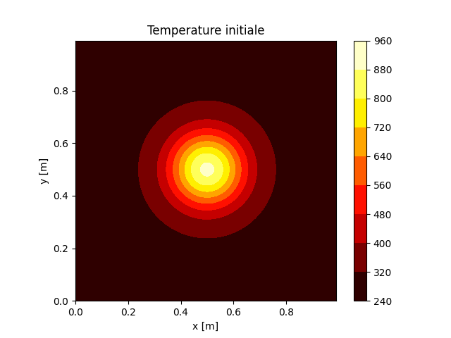
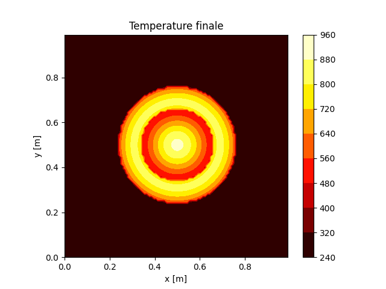

# **<p style="text-align: center;">Rapport de mini projet</p>**
### <p style="text-align: center;">Analyse numérique</p>
<p style="text-align: center;">Par Gbado Douala Crésus Pierre et Thomas Timothée</p>

## Problématique
Le calcul numérique est un outil puissant permettant de résoudre de nombreuses équations et aidant la communauté scientifique à
découvrir et expliquer les phénomènes les plus complexes. La librairie NumPy permet d'intégrer la plupart des fonctions,
objets et outils. Ce rapport propose un examen des performances de NumPy dans un contexte d'analyse numérique appliquée
dans un premier temps à l'intégration de fonctions polynomiales et dans un second temps à la répartition de chaleure sur une
plaque d'aluminium suite à un fort gradiant de température ponctuel.

## Intégration numérique
### Méthodologie
La méthode des rectangles a été utilisée pour calculer l'aire sous la courbe d'une fonction polynomiale d'un ordre inférieur à 3.
Trois approches ont été mises en œuvre : une utilisant la bibliothèque NumPy pour effectuer le calcul numérique, une seconde
implémentant directement la méthode des rectangles et enfin à travers une résolution analytique. Une fonction est ainsi pour 
calculer l'erreur entre les deux méthodes.

### Résultats
L'augmentation du nombre de rectangles sous la courbe tracée par la fonction polynomiale permet de réduire drastiquement 
l'erreur qu'il existe entre cette méthode et l'intégration réalisée avec numpy :  

``solve_integration_numpy(p1, p2, p3, p4, debut, fin, n)`` 

La Figure 1 permet  de visualiser la convergeance des résultats et l'importance d'une discrétisation suffisante pour garantir un résultat cohérent.
<p align="center">
 
 <p style="text-align: center;">Figure 1 : Impact du nombre de rectangles sur l'erreur</p>
</p>

La Figure 2 permet de constater le revers de l'augmentation arbitraire du nombre de rectangle, ceux-ci impliquant alors une augmentation
trop importante du nombre de calculs et donc du temps de résolution. Il est pertinent de noter la relative stabilité du
temps de calcul recquis par la bibliothèque NumPy pour résoudre la même équation.

<p align="center">
 
 <p style="text-align: center;">Figure 2 : Impact du nombre de rectangles sur le temps de calcul</p>
</p>

### Conclusion
La performance de la bibliothèque NumPy pour le calcul numérique, en particulier lorsqu'elle est comparée à une 
implémentation directe de méthodes numériques telles que la méthode des rectangles semble bien plus élevée. Ainsi, une convergeance
rapide du résultat est obtenue sans un grand nombre de calculs grâce à la bibliothèque Numpy.  

## Equations de chaleur
### Méthodologie
La simulation thermique nécessite d'ordinaire de nombreuses équations pour parvenir à recréer fidèlement les phénomènes en jeu
lors d'évènements brutaux ou spontanés. La librairie NumPy est ici utilisée pour valider son utilisation dans un contexte plus sévère.
plusieurs fonctions sont nécessaires, notamment pour la génération de la grille de calcul, la définition de la solution initiale,
 l'avancement temporel ou la visualisation de la distribution de la température. La grille de température est une matrice en 3 dimensions,
une latérale, une longitudinale et une troisième temporelle.  

``temperature = np.ndarray(shape=(n_x+1, n_y+1, int(temps_simulation/dt)), dtype=float)``  

La définition du pas temporel est un élement important de toute simulation par différence finie. Ainsi le pas temporel est
dans ce programme défini par l'équation ci-dessous.  
<p align="center">
    
</p> 
Où F0 = 0.25 et où le pas longitudinal est définis par l'utilisateur à travers le nombre de points désirés sur la surface à simuler.  
L'état initial de la plaque est donné par une répartition gaussienne de la température centrée autour du point de chauffe.
A chaque itération temporelle, l'évolution de la température est calculée grâce au paramètre ```RHS``` en parcourant l'ensemble de la 
grille de température, cette étape est réalisée grâce à la fonction ``calcul_RHS()`` ci-dessous :  
``calcul_RHS(RHS, temperature, n_x, n_y, delta_x, delta_y, k, pas)``

De plus, le programme doit enregistrer et analyser diverses grandeurs (minimum, moyenne et maximum de température) sur le
domaine, ainsi que les normes du résidu pour évaluer la convergence du champ de température au cours du temps. Enfin,
le temps de calcul est enregistré à l'aide du chronomètre de la libriarie ```time.perf_counter()``` pour évaluer 
l'efficacité de la solution mise en œuvre.

### Résultats
La répartition initiale de température peut être visualisée sur la Figure 3, l'ensemble de la plaque dispose d'une température
initiale demandée à l'utilisateur, seule la partie chauffée par le point chaud et dans la zone voit sa température modifiée.

<p align="center">
  
<p style="text-align: center;">Figure 3 : Visualisation d'un état initial</p>
</p>

La Figure 4 permet d'observer un état intermédiaire où la chaleur tends à se répartir dans toutes les directions. La visusalisation
de sa propagation est le principal objectif de ce programme.

<p align="center">
  
<p style="text-align: center;">Figure 4 : Visualisation d'un état intermédiaire</p>
</p>

Le programme permet également de connaitre le temps d'execution de la simulation. Il permet alors de quantifier l'efficacité
du modèle programmé et peut aider l'utilisateur à ajuster au mieux les paramètres pour garantir une performance optimale.

### Conclusion
Notre étude démontre l'efficacité de l'approche de simulation numérique pour étudier la distribution de la température dans un bloc d'aluminium.
De plus la librairie NumPy et la vectorisation des calculs permettent d'accroitre les performances du modèle et de limiter le temps de calcul.
