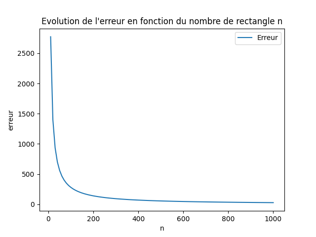
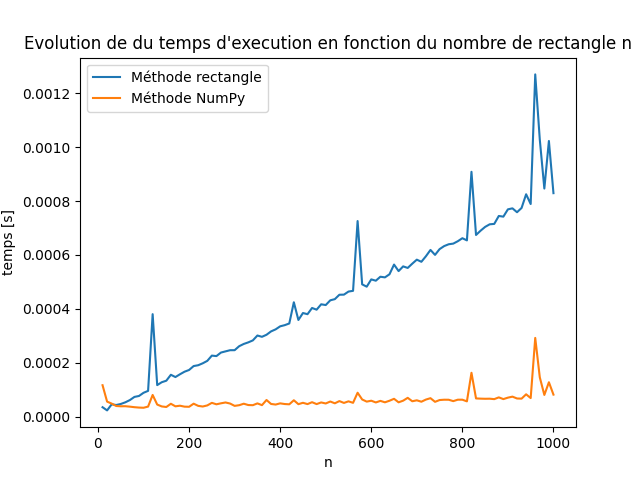

# **
Rapport de mini projet
**
### 
Analyse numérique

Par Gbado Douala Crésus Pierre et Thomas Timothée

## Problématique
Le calcul numérique est un outil puissant permettant de résoudre de nombreuses équations et aidant la communauté scientifique à
découvrir et expliquer les phénomènes les plus complexes. La librairie NumPy permet d'intégrer la plupart des fonctions,
objets et outils. Ce rapport propose un examen des performances de NumPy dans un contexte d'analyse numérique appliquée
dans un premier temps à l'intégration de fonctions polynomiales et dans un second temps à la répartition de chaleure sur une
plaque d'aluminium suite à un fort gradiant de température ponctuel.

## Intégration numérique
### Méthodologie
La méthode des rectangles a été utilisée pour calculer l'aire sous la courbe d'une fonction polynomiale d'un ordre inférieur à 3.
Trois approches ont été mises en œuvre : une utilisant la bibliothèque NumPy pour effectuer le calcul numérique, une seconde
implémentant directement la méthode des rectangles et enfin à travers une résolution analytique. Une fonction est ainsi pour 
calculer l'erreur entre les deux méthodes.

### Résultats
L'augmentation du nombre de rectangles sous la courbe tracée par la fonction polynomiale permet de réduire drastiquement 
l'erreur qu'il existe entre cette méthode et l'intégration réalisée avec numpy :  

``solve_integration_numpy(p1, p2, p3, p4, debut, fin, n)`` 

La Figure 1 permet  de visualiser la convergeance des résultats et l'importance d'une discrétisation suffisante pour garantir un résultat cohérent.

Figure 1 : Impact du nombre de rectangles sur l'erreur

La Figure 2 permet de constater le revers de l'augmentation arbitraire du nombre de rectangle, ceux-ci impliquant alors une augmentation
trop importante du nombre de calculs et donc du temps de résolution. Il est pertinent de noter la relative stabilité du
temps de calcul recquis par la bibliothèque NumPy pour résoudre la même équation.

Figure 2 : Impact du nombre de rectangles sur le temps de calcul

### Conclusion
La performance de la bibliothèque NumPy pour le calcul numérique, en particulier lorsqu'elle est comparée à une 
implémentation directe de méthodes numériques telles que la méthode des rectangles semble bien plus élevée. Ainsi, une convergeance
rapide du résultat est obtenue sans un grand nombre de calculs grâce à la bibliothèque Numpy.  

## Equations de chaleur
### Méthodologie

